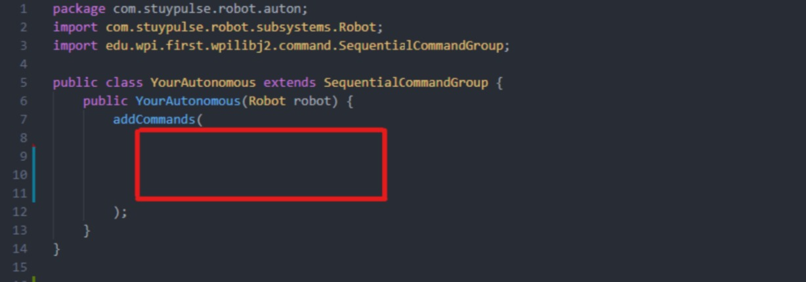

# TurtleRomi

A **Romi** is a small robot with two programmable wheels that we will be using to get familiar with robot coding.

In today’s activity, we will ask you to make use of four simple commands to make the Romi move around! (Like a turtle)

You will be provided with a folder called Turtle Romi in which all the code for operating a robot has already been written for you. The only file that you will edit is called `YourAutonomous.java` and is located in the following directory: `TurtleRomi/src/main/java/com/stuypulse/robot/auton`

When you first open your file, it will look like this (without the red box). Any of the commands (listed on the back page) can be typed into the section marked in red. This can be seen in the example below:

When running the code with the above example, I expect the Romi to go forward 3.4 feet, turn 90 degrees counter clockwise and then move backwards 2 feet.

### Turtle Romi Commands

| Command|Description|
|--------------|-----------|
|robot.forward(x)| Move Romi forward by x feet.|
|robot.back(x)|Move Romi backward by x feet.|
|robot.right(x)|Turn Romi clockwise by x degrees.       |
|robot.left(x)|Turn Romi counter clockwise by x degrees.|

### Challenge
Use the Commands in the table above to navigate the robot through the following obstacles:  

